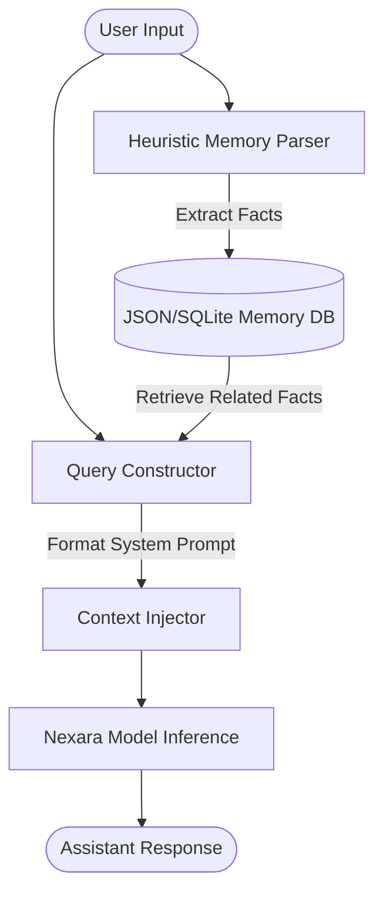

# Nexara v1 Master Plan: The 8-Phase Roadmap

This document outlines the product decisions, versioning strategy, scaling path, release criteria, and next-phase designs to guide Nexara from an internal prototype to the final public **Nexara v1** release.

---

## 1. Product Decision

Nexara will only be released publicly after completing all **8 phases** of development. 

* **Internal Research Checkpoints**: All checkpoints generated prior to the final integration are strictly internal research models. They are designed for validation, system testing, and design space exploration.
* **No Public Release Yet**: We will not upload intermediate model weights (`*.pt`) to public repositories, nor publish checkpoints to Hugging Face or public packages until the final v1 release criteria are fully met and approved.

---

## 2. Current Status

* **6.8M Prototype Archive**:
  * **`Nexara Tiny Prototype v0.1-base`**: 6.8M parameter base model trained on TinyStories (100,000 steps, validation perplexity **5.18**). Archived.
  * **`Nexara Tiny Prototype v0.2-chat`**: 6.8M parameter chat model checkpoint (3,000 SFT examples, validation perplexity **24.37**). Archived.
* **Current Target Backbone**: **`Nexara Tiny 100M`** (97.5M parameters, max sequence length 512, trained with a BPE 16k tokenizer).
* **Phase Status**:
  * **Phase 1 (Base Model)**: **Re-running pretraining** with the new `Nexara Tiny 100M` backbone on a mixed pretraining corpus. 100-step GPU validation smoke training completed successfully.
  * **Phase 2 (Instruction/Chat)**: Proposed for `Nexara Tiny 100M` once Phase 1 is complete.
  * **Phase 3 (Memory System)**: Proposed for `Nexara Tiny 100M` (currently in planning).

---

## 3. Naming and Versioning Strategy

To maintain version control and distinguish intermediate model targets, we establish the following naming convention:

| Target Model | Parameter Size | Phase | Release Class | Description |
| :--- | :---: | :--- | :--- | :--- |
| `Nexara Tiny Prototype v0.1-base` | 6.8M | Phase 1 (Archived) | Internal Archive | Original pretrained story model. |
| `Nexara Tiny Prototype v0.2-chat` | 6.8M | Phase 2 (Archived) | Internal Archive | Original chat prototype. |
| `Nexara Tiny 100M-base` | 97.5M | Phase 1 (Active) | Internal Base | Scaled-up base pretraining model. |
| `Nexara Tiny 100M-chat` | 97.5M | Phase 2 (Future) | Internal Chat | Instruction-tuned 100M model. |
| `Nexara Tiny Memory v0.3` | 97.5M | Phase 3 (Future) | Internal Prototype | 100M model with conversation memory. |
| `Nexara Tiny Tools v0.4` | 97.5M | Phase 4 (Future) | Internal Prototype | 100M model with tool-calling. |
| `Nexara Tiny RAG v0.5` | 97.5M | Phase 5 (Future) | Internal Prototype | 100M model with RAG context. |
| `Nexara Tiny Agent v0.6` | 97.5M | Phase 6 (Future) | Internal Prototype | 100M model in agent execution loops. |
| `Nexara Tiny Aligned v0.7` | 97.5M | Phase 7 (Future) | Internal Prototype | 100M model aligned for safety. |
| `Nexara tiny v1` | 97.5M | Phase 8 (Final) | **Final Public Release**| Fully integrated, public v1 model. |

---

## 4. Scaling Strategy and Path

We have successfully transitioned the primary model backbone from the **6.8M** parameter prototype scale to the **100M** scale (`Nexara Tiny 100M` at **97,555,968** parameters). This change provides the capacity required for complex reasoning, instruction following, and structured formatting (math, lists, JSON parsing) that the prototype scale lacked.

### Scaling Progression

1. **6.8M Parameters (Prototype Archive)**:
   * *Purpose*: Initial code validation, pipeline debugging, and basic chat/story exploration.
   * *Status*: Completed and archived.
2. **100M Parameters (Nexara Tiny 100M - Current)**:
   * *Purpose*: Robust causal language baseline with 12 layers, 12 attention heads, 768 embedding dimensions, and a 16,384 vocabulary size. Max sequence length is scaled to 512.
   * *Status*: Active. Pretraining validation completed successfully on NVIDIA T4 GPU.
3. **250M+ Parameters (Possible v1-Class Expansion)**:
   * *Purpose*: Large-scale capacity improvements if compute resources allow.
   * *Architecture*: 24 layers, 16 attention heads, 1024 embedding dimension. Not initiated.

> [!IMPORTANT]
> **No retraining of larger models will begin at this stage.** We are only planning the scaling path.

---

## 5. Release Criteria for Nexara v1

The final public release of **Nexara tiny v1** must satisfy the following criteria:

* **Stable Chat Interface**: High conversational quality, robust multi-turn stability, and resistance to mode collapse or attractor loops.
* **Memory System**: Successful extraction, persistence, and injection of conversation context and long-term user facts.
* **Safe Tool Calling**: Ability to generate tool-invocation tokens and handle tool outputs safely without execution injection vulnerabilities.
* **RAG over Knowledge Base**: Accurate context retrieval and grounded generation over local project markdown documents.
* **Agent Loop**: Semi-autonomous execution utilizing a limited, safe set of local tools with clear success/fail state tracking.
* **Alignment and Safety**: Zero tolerance for harmful prompts, robust jailbreak resistance, and polite alignment guardrails.
* **Honest Limitations**: Complete documentation of model boundaries (what it cannot do).
* **Reproducible Training Reports**: Verification logs, loss curves, and perplexity reports for all training phases.
* **Model Card**: Fully compliant model card containing architecture, training data, and safety profiles.
* **Demo Interface**: Easy-to-use user interface (e.g., terminal CLI, web page, or simple API).
* **Install/Run Instructions**: Standardized, cross-platform virtual environment setup scripts.

---

## 6. Next Implementation: Phase 3 Memory System Plan

Because Nexara has a limited context window (`max_sequence_length: 256`), we cannot fit extensive conversation history directly in-context. Phase 3 will implement an external memory system that operates outside the model parameters and interacts via dynamic context injection.

### Memory System Architecture



### Key Components

1. **Short-Term Memory (Context Windowing)**:
   * Implement a sliding window conversational buffer that drops older turns when approaching sequence limits.
   * Add text-based summarization of historical turns when context usage exceeds 70%.
2. **Long-Term Memory (Key-Value/JSON Store)**:
   * Maintain a local `memory.json` per session storing extracted key facts (e.g., `user_name`, `user_preferences`, `stated_facts`).
   * A Python controller reads the database and injects relevant memories into the System Prompt.
3. **Memory Extraction (Heuristic/Rule-Based)**:
   * Write lightweight regex and keyword-based extractors to parse user statements like *"My name is..."* or *"I like..."* without relying on model-generated tool calls.
4. **Context Injection Template**:
   * Modify the System Prompt dynamically:
     ```text
     ### System:
     You are Nexara, a helpful AI assistant.
     [Known Facts: User's name is Satya. User likes rabbits.]

     ### User:
     Hi! What is my name and what animal do I like?
     ```

### Phase 3 Verification Plan (Pre-Implementation)
* **Test Suite**: Write unit tests verifying fact extraction, storage, and retrieval from `memory.json`.
* **Inference Test**: Run evaluations demonstrating that the model correctly recalls injected facts during a dialogue turn.
